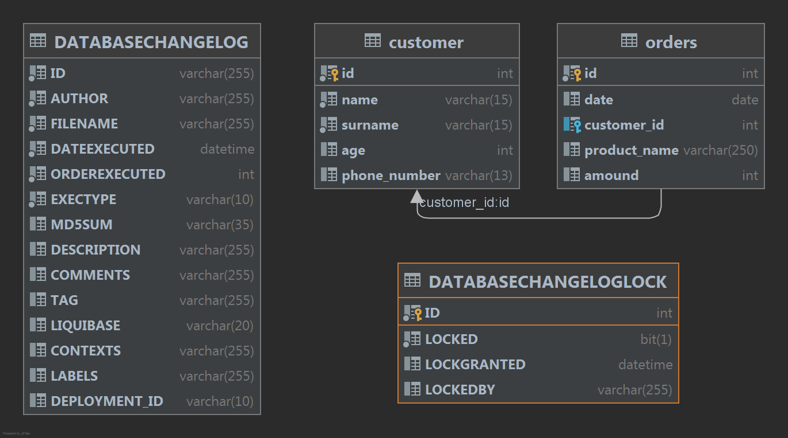

# Rest сервер с взаимодействием с БД
## Описание
Программа представляет возможность получения JSON объектов из БД. На контроллере сконфигурирован один мапинг для получения данных.
В составе программы используются:
1. RestController обрабатывающий входящие и исходящие запросы.
2. MySql сервер (возможно поднять контейнер Docker).
3. Liquebase миграция, использующаяся для первоначального создания и наполнения данными.
  
## Предварительные настройки
1. Настроить подключение к БД. При разработке поднимал docker контейнер с MySQL Server 8.0.28-1debian10.
```
docker run -v /mysql_data:/var/lib/mysql -e MYSQL_ROOT_PASSWORD=mysql -p 3306:3306  mysql
```
2. Настраиваем параметры подключения к БД в файле application.properties  
```
spring.datasource.url=jdbc:mysql://192.168.99.100/jdbctemplate?createDatabaseIfNotExist=true
spring.datasource.username=root
spring.datasource.password=mysql
```
3. Если при запуске программы хотите использовать sql скрипты (schema.sql, R_insert_data.sql) расположенные в корне папки resource, тогда необходимо  раскомментируйте строку в application.properties  
```
#spring.sql.init.mode=always
```
4. При необходимости скорректируйте мастер файл Liquebase db.changelog-master.yaml. В программе предоставлены 3 варианта (файла) создания таблиц - .yaml, .sql, xml. В соответствии с текущей настройкой мастер файла будет выполнен .xml.  

## Запуск программы
1. Поднимается TomCat на порту 8080
2. Происходит подключение к БД и создании указанной схемы - jdbctemplate
3. Стартует Liquebase и создает таблицу "customer" и записывает действие в историю (таблицы DATABASECHANGELOG, DATABASECHANGELOGLOCK)
4. Необходимо наполнить БД данными, например выполнить data.sql

## Схема БД


## Выполнение
переходим по ссылке   
http://127.0.0.1:8080/products/fetch-product?name=vasya и получаем ответ от сервера с названием товара в зависимости от переданного параметра